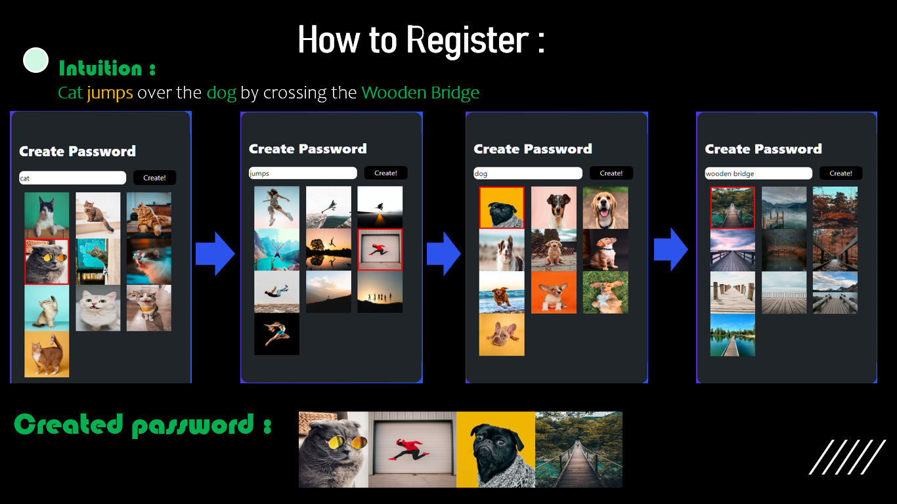

# _OneLogin_

**_A domain shifting and ground breaking novel algorithm to redefine the way developers view Auth Systems._**

# What is a Graphical Authentication System Anyway?
- A Graphical Auth system, is by defination made of graphics instead of tradtitional alphanumerics.
- The _ad reductio_ idea stems from the fact that alphanumerics are just input symbol.

# What's the Fuzz about?

- While graphical Auth systems have been around for years now (the first occurance of such concept dates back serveral years), they have mostly been unviable due to various practical flaws.

- We beleve, that we have found a novel way to eliminate one of the major attack vectors of this system known as Reload Attack.

- The OneLogin (TM) algorithm eliminates all chances of this attack vector by using a mathemataically superior approach with entropy greater than it will take to reach the singularity.

- The OneLogin (TM) algorithm performs upto 1.5 times better in uniformly distributed value tests and takes upto 12% less space to store as an hash.

- The algorithm has a Sum over Product of Factorial complexity that far exceeds that of any Alphanumeric Language, it uses a novel new data structure that does lazy prop on a link cut tree (inspired from pashka, see code for more info on impl)

# What do we Do?
- We provide an easy to use solution for Developers with enhanced interoperability.
- Our SDK has plenty documentation and a small but friendly community behind it.
- Easy on users, Easay on devs, what else could one need? :)

# Links

- [GitHub Repository](https://github.com/aayanlobo/ecell_nitb_hack2k23_HackTheHustle)
- [OneLogin (TM) Algo](https://pastebin.com/bn0ZgXan)
- [Deployed Project](https://cl-gamma.vercel.app/)

# Showcase
|        |
| :--------------------------------------------------: | :-----------------------------------------------------: |
|  |  |